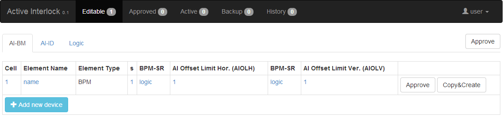
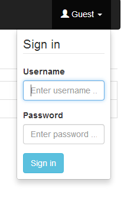
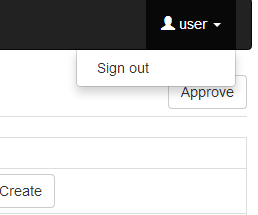
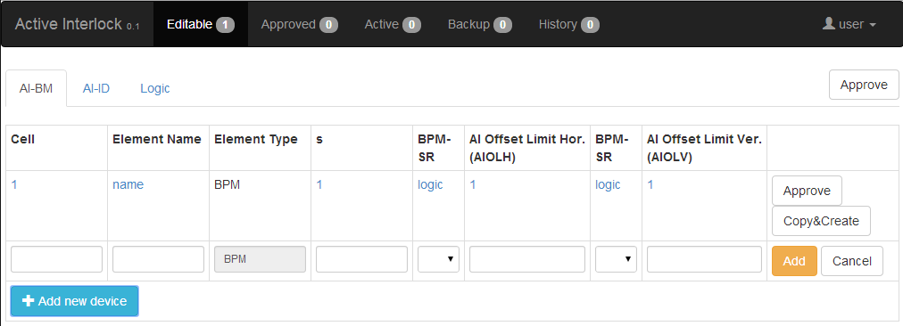
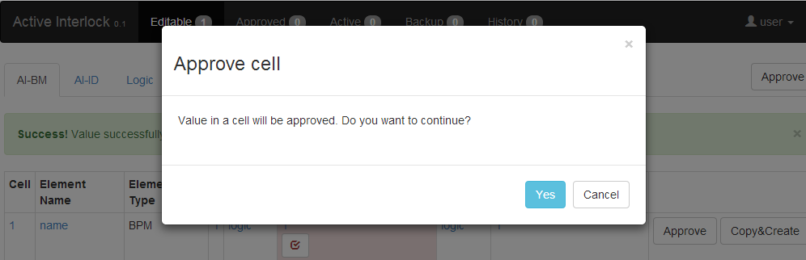
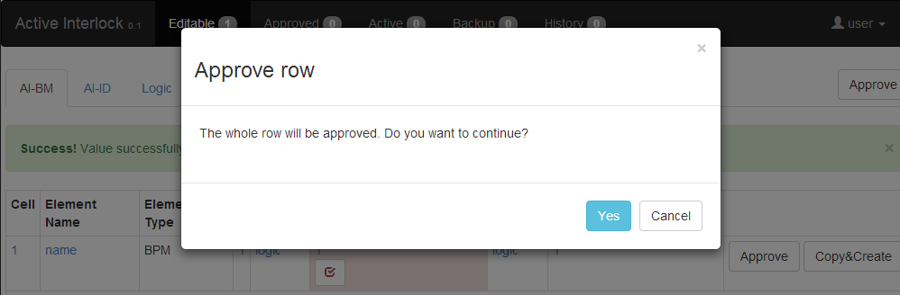
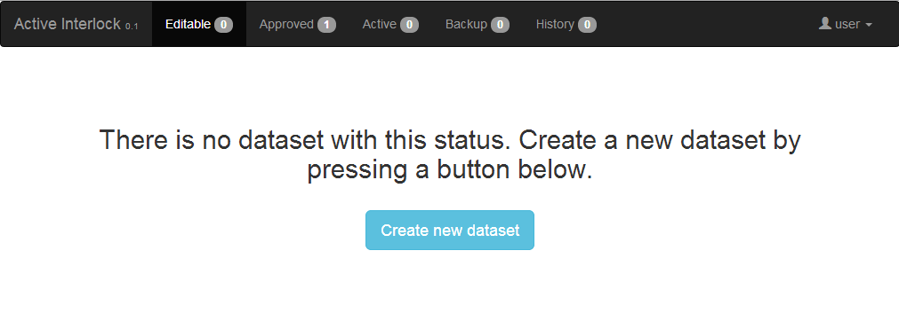
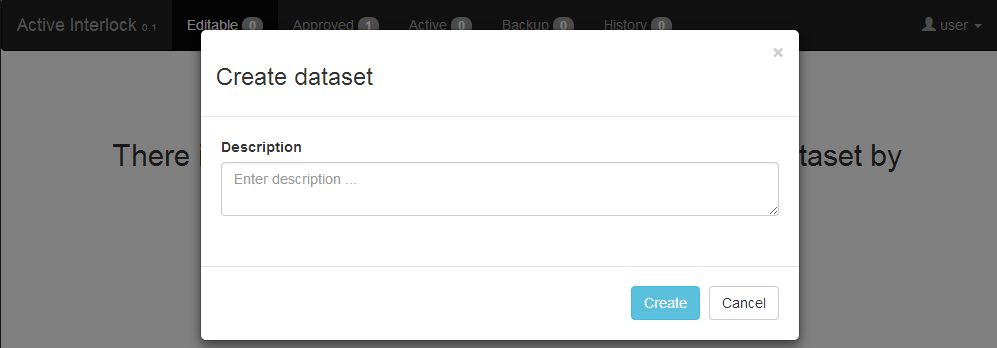
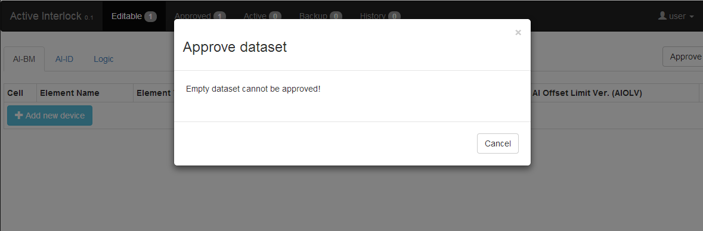
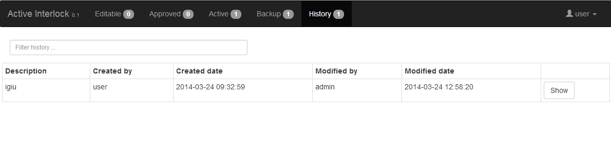

ActiveInterlock Web Client Interface
==============================================

The ActiveInterlock web client is implemented using *Angular.js* and *jquery*. It connects to the server through a RESTful Interface and is served by the Django server.

Description and Usage of the User Interface
--------------------------------------------

Description of the Layout
~~~~~~~~~~~~~~~~~~~~~~~~~~~~

The web client user interface comprises of a navigation bar on the top and the body below it. The navigation bar has menu items that represent all of the available statuses of the dataset (Editable, Approved, Active, Backup, History). On the right there is a dropdown element that allows the user to sign into and out of the system. By clicking on the status menu item, dataset is displayed in the body.

In the body of the user interface, the entire dataset is displayed. The dataset has three tables (SR-BPM, ID-BPM, Logic) and they can be viewed by selecting the appropriate tab in the tab navigation bar on the left. On the right there are buttons that enable user to "move" a dataset from one status to another.

Every dataset part (SR-BPM, ID-BPM, Logic) is displayed in its own table. Every row represents a device or logic and every cell contains a property of the device that must be captured. The table can be editable or not depending on user permissions. When the table is editable, data in most of the cells can be changed and thus updated. After updating, some cells also need to be approved. Data can be approved by clicking on the button that appears below the value after updating. To speed things up, the whole row can be approved by clicking on the approve button which is positioned at the end of every row. New device and logic can be added by pressing the **Add new device** or **Add new logic** buttons.

   
   Home screen displaying BM device.

Sign in / Sign out
~~~~~~~~~~~~~~~~~~

Datasets are read-only by default. Adding and modifying existing data requires a user account with special permission. Sign in by clicking on the Guest button at the top right corner which brings up the Sign In dialog. After entering the account credentials, click on the **Sign in** button.

   
   Sign in

Sign out by clicking on your user name on the top right and selecting **Sign out**.

   
   Sign out

Adding, Modifying and Approving Data
~~~~~~~~~~~~~~~~~~~~~~~~~~~~~~~~~~~~~~

Only signed in users can add, modify or approve data. 

To add a new device or logic, click on either the **Add new device** or **Add new logic** button. A new row is displayed which allows for properties of the new device or new logic to be defined. After all necessary values have been entered, click on the **Add** button to save new device/logic or **Cancel** to cancel this action.

   
   Add a new device into BM table.

After adding a new device/logic, the background of certain cells get a red background and the **Approve** button appears. This indicates that data in these cells need to be approved before the entire dataset can be approved and thus used. After clicking on the **Approve** button, a pop up appears with a warning message. Click on **Yes** to approve the value. 

   
   Approve a single value.

To approve the entire row, click on the **Approve** button at the end of the row. After clicking on this **Approve** button, a pop up appears with warning message. Click on **Yes** to approve the entire row.

   
   Approve the entire row.

Adding and Approving Datasets and Changing the Status of a Dataset
~~~~~~~~~~~~~~~~~~~~~~~~~~~~~~~~~~~~~~~~~~~~~~~~~~~~~~~~~~~~~~~~~~

In the navigation bar, there are five buttons which represent the possible statuses of the dataset:
* Editable
* Approved
* Active
* Backup
* History

Next to the name of the status is a badge with the number of datasets that have that status. All of the statuses, except **History**, can only apply to one dataset at a time. All of the datasets that were **Active** end up in **History** when they are replaced with a new dataset.

When new datasets are added, they have a status set to **Editable**. Consequently, in the web client, new datasets are added by first selecting the  **Editable** status from the top menu and then clicking **Create new dataset**. A pop up appears where a description for a new dataset is entered. Then click on **Create**.

   
   Create dataset.
   

   
   Enter description and click Create.

After logic and devices are entered and approved, the entire dataset can be approved by clicking the **Approve** button at the right of the row that has the tabs.

   
   Approve dataset.

After the dataset is approved, the web client is automatically refreshed and the dataset is now accessible. Click on the **Approved** menu item. The **Editable** status is now empty (0 items) and a new dataset can be created.

Dataset History
~~~~~~~~~~~~~~~~

When data is downloaded, it gets the **Active** status. If there was aleady a dataset with an **Active** status, its status changes to gets **Backup** and if there was already a dataset with a **Backup** status, its status changes to **History**. Therefore all **Active** datasets are eventually moved into **History** as they are replaced by new datasets. By clicking on the **History** menu item, a table with all datasets with a status of **History** are displayed. The table displays important information like date created, dataset author, description etc.

   
   History view.

Every row in the **History** table has a **Show** button. Clicking on it, displays the dataset, as for any other status. However, the difference here is that the data is read-only.