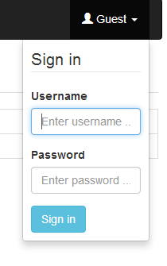
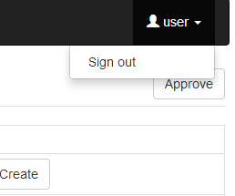

Lattice/Model Web Client Interface
============================================

The Lattice/Model web client is implemented using *Angular.js* and *jquery*. It connects to the server through a RESTful Interface and is served by the Django server.

Description of the Layout
--------------------------------------------

The web client user interface comprises of 4 main areas:
	* a navigation bar on the top, and
	* the body below which is made up of (from the left):
		- Search pane 
		- Search results/Summary pane
		- Details pane

The top navigation bar contains a button to upload lattices and models and on the right there is a dropdown element for signing into and out of the system. 

In the body of the user interface, search parameters are entered into the Search pane on the left, results are displayed in a summary format in the middle pane and details of a lattice or model are displayed on the Details pane on the right. 

   
   Home screen.

Sign in / Sign out
--------------------------------------------

By default, Lattice and Model information in the database can only be browsed. Adding new lattice/model data and modifying existing data requires a user account with special permission. Sign in by clicking on the **Guest** button at the top right corner which brings up the Sign In dialog. After entering the account credentials, click on the **Sign in** button.

   
   Sign in

Sign out by clicking on your user name on the top right and selecting **Sign out**.

   
   Sign out

Adding Data
--------------------------------------------

Only signed in users can add data. 

To add a new lattice or model, click on either the **Upload Lattice** or **Upload Model** button on the top navigation bar. 

   
   Add a new lattice or model.

A popup appears. When all fields have been filled in, click on the **Upload** button. 

   
   Details for new lattice.

   
   Details for new model.

Searching for Existing Data
--------------------------------------------

Any user (i.e. guest and signed in) can search for existing lattice or model data. 

Select to search for either lattice or model data with the radio buttons at the top of the Search pane.  

When searching for lattice data, wildcards are supported for `name`, `branch`, `description`, and `creator`.

   
   Search for lattice data.

When searching for model data, wildcards are supported for name.

   
   Search for model data.

Results of the search are displayed in the middle pane, in a summary format. Clicking on any individual entry, displays the details of that entry in the Details pane. Results can be further filtered by entering characters corresponding to any of the displayed text.

Working with Lattice Data
--------------------------------------------
Browsing Lattice Data 
~~~~~~~~~~~~~~~~~~~~~~~
Simply clicking on an entry in the Results pane opens the details of the selected lattice. The header information appears at the top and the full details of the lattice appear below. There is the option of downloading the original lattice data by clicking on the **Download the original file** button or downloading a zip-archive of the original file and the maps by clicking on the **Download zip with original file and maps** button. 

   
   Search results and details for lattice.

Updating Lattice Status
~~~~~~~~~~~~~~~~~~~~~~~
Signed in users can update the lattice status by clicking on the **Update lattice** button on the top right of the lattice details view, selecting the new status from the dropdown list and then clicking on **Update**.  

   
   Update lattice status.

Comparing Lattices
~~~~~~~~~~~~~~~~~~~~~~~
In the Results pane, there is the option of selecting whether to compare different lattices, by checking the **Select for comparison** boxes next to each result. When more than one box is checked, two buttons appear: **Compare lattices** and **Clear selection**. Clicking on the **Compare lattices** button displays the data of the selected lattices in columns. The right-most **Diff** column is green if there are differences and red if there are no differences in the data for the specific device. Clicking on the arrow in the **Diff** column shows more details.
The data can be filtered futher by either entering a specific device name or choosing to only display devices with differences. Click on the **Filter lattice table** button to execute the filter.

   
   Compare lattices.

Working with Model Data
--------------------------------------------

Browsing Model Data 
~~~~~~~~~~~~~~~~~~~~~~~
Simply clicking on an entry in the Results pane opens the details of the selected model. The header information appears at the top. 

   
   Search results and details for model.

Clicking on the **Show simulation control data** button displays full details of the simulation parameters.
   
The Model Details section at the bottom allows to search for specific model parameters and then presents the option to plot the selected paramters. 
 .. figure:: _static/PlotModel.png
   :scale: 75%
   
   Plot selected model parameters

   
Updating Model Status
~~~~~~~~~~~~~~~~~~~~~~~
Signed in users can update the model status by clicking on the **Update model** button on the top right of the model details view, selecting the new status from the dropdown list and then clicking on **Update**.  

   
   Update model status.

Plotting Data from Multiple Models
~~~~~~~~~~~~~~~~~~~~~~~~~~~~~~~~~~
In the Results pane, there is the option of selecting whether to plot data from the model, by checking the **Select for plotting** boxes next to each result. When more than one box is checked, two buttons appear: **Plot multiple models** and **Clear selection**. Click on **Plot multiple models** and then enter the ``s`` position of starting element and the ``s`` position of the ending element. Select the type of parameter from the dropdown list. Available parameters that satisfy the criteria are displayed. Check the boxes of those parameters to be plotted and click on the **Plot data** button. Other buttons control plot parrameters.  

   
   Plot parameters from multiple models.

