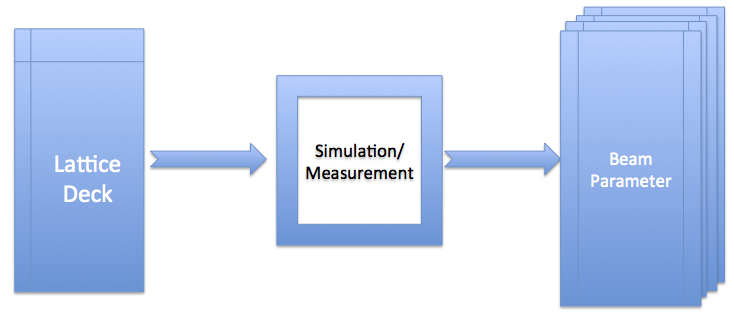
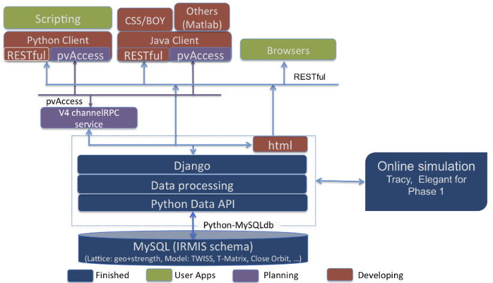

The Lattice/Model Service
=========================

Introduction
------------
As its name indicates, the Lattice/Model service consists of 2 parts, namely the lattice and model parts respectively. 
The lattice part captures element geometric information (layout with misalignment), and magnetic strength of each element, if applicable. A lattice can originate from any source such as a design release, a test case, a study senario, and/or a physical installation and real measurement. 
The model part captures beam parameters such as beam Twiss optics, closed orbit, transfer matrix for each element, and some global parameters if applicable, e.g., tune, chromaticity, beam energy, etc. and can be a result generated from simulation or data from a measurement.

Terminology
-----------
The following terms are used in this service:

*Element*
	an individual component of a lattice, which could be a real hardware device, or a virtual entity.

*Lattice*
	an accelerator geometric layout with a magnetic strength setting for each element.

*Lattice Deck*
	an input container for a particular simulation code. For example, a ``.lat`` file for Tracy, or a ``.lte`` file for elegant

*Model*
	a result from either simulation or measurement for a given lattice.

*Tracy*
	a particle accelerator simulation code [1]_

*elegant*
	a particle accelerator simulation code [2]_

**Note**: 

- One lattice can consist of one or more elements. One element could be a real device physically installed somewhere, e.g. a quadrupole magnet,
  or a virtual device, e.g. a marker.
- One Lattice deck may contain many lattices. Typically, a lattice deck is an input file for a particular simulation code.
- One lattice may have many models. One lattice with different simulation code, and/or different simulation algorithms is a different model 
  since it produces different results.

The relation between a lattice and a model is as shown in Figure 1.

    Figure 1: Generate model results from a lattice deck

.. _lattice_model_architecture:

Architecture
-------------
The system architecture is shown in Figure 2.

    Figure 2: Lattice/Model Service Architecture

The service consists of 3 layers, which are the Relational Database (RDB) layer, the Service layer, and the Client layer.

*RDB Layer* 
	All data is stored inside this layer. The data could be real, e.g. element name or magnetic strength, or links to external files on the file system. The RDB schema is derived from the IRMIS schema, which was originally developed by Don Dohan at Brookhaven National Laboratory. It uses a MySQL RDBMS (relational database management system) as a backend data storage engine. 

*Service Layer*
	The Service layer responds to requests from the client and reads data from and writes data into the database. The database is accessed via a data API (application programming interface), which isolates the RDB access details and business logic from the RDB client. The advantage with the data API is that it makes any internal schema changes transparent to the RDB client, which gives both the RDB schema expert and service developer more flexibility. Two major functions are provided in this layer. 
	
	1. As a data storage center, it receives all data from the client, and stores the data in the RDB, and sends data back. 
	2. It provides a quick online simulation when a proper lattice deck with required model control information is provided.

*Client Layer* 
	The Client layer provides an interface to the end user in 2 formats: 
	
	1. API library, which can be used by a client application, e.g. a Python script or a Matlab application; 
	2. user interface, a graphic interface from a web browser, or from a CSS (Control System Studio) application.

The service is implemented using the Django framework, and in phase I, return data through a REST web-service. An extension to EPICS V4 and returning data through pvAccess (the EPICS V4 communication protocol) will be implemented in its next major release.

Lattice
-------
As described above, the lattice captures element geometric layout with one particular magnetic strength. The information includes lattice description and lattice data.

Information making up a lattice description includes:

- lattice name, could be up to 255 characters
- lattice version, which has a numeric format
- lattice branch name, could be up to 50 characters
- brief description, could be up to 255 characters
- who first created this lattice 
- when this lattice was first created 
- who last updated/modified this lattice 
- when this lattice was last updated/modified 
- raw lattice data file

A particular lattice could be identified by its name, version and branch, which means a given lattice for one branch at given version is unique.
For a particular lattice, the following information is saved:

- element name: name of each element in the lattice;
- element position: which is also so-called "s" location;
- element sequence index: beware that often simulation code has an internal element at its start point, e.g. "BEGIN" in tracy and "_BEG_" in elegant. Since this kind of element is not included in the lattice deck, the first index should be one (1) for these simulations, otherwise, it should be zero (0).
- element length;
- mis-alignment information, displacements (:math:`\delta x, \delta y, \delta z`), and rotations (pitch, yaw, and roll);
- element type: the type defined in a lattice. The Lattice service does not force any element type, and does not use an internal type. Therefore, it saves whatever the element type is received from the client, e.g. a lattice file. An element type in Tracy could be for example "Quadrupole" while it could be "CSBEND" in elegant.
- element type property: attribute names of an element type. For example, the elegant element type CSBEND could have properties of ANGLE for bend angle, E1 for entrance edge angle, E2 for exit edge angle, etc.
- element type property value: value for each type property, for example 0.10472 rad for ANGLE, 0.05236 rad for E1, 0.05236 rad for E2, etc.

A lattice is also associated with a status, which is an integer. Users can use this in their own way, and a typical use case is to identify whether a lattice is a golden lattice by applying their own convention. The lattice status could have information as follows:

- lattice id to identity which lattice the status is for
- who first created this lattice 
- when this lattice was first created 
- who last updated/modified this lattice 
- when this lattice was last updated/modified 
- latest status id, which is an integer number

If the lattice has a specific format, e.g. a lattice deck or a flat text file, the type information with its format is also captured. For example, an elegant lattice could be captured with its type as "elegant", and its format as "lte".

Model
-------
A model is defined as one result generated by either a simulation code with a given lattice, or a measurement. It creates a new model when the simulation code changes, or the algorithm used by a simulation changes, or a new measurement was conducted.

The data consists of 2 types, which are global beam parameters like tune values, chromaticities, and some description information, and beam parameters for each element like twiss parameters, closed orbit, and so on.

Global model information could be follows:

- model name, could be up to 255 characters, and is unique
- lattice id, to identify which lattice this model belongs to
- brief description, could be up to 255 characters
- who first created this lattice 
- when this lattice was first created 
- who last updated/modified this lattice 
- when this lattice was last updated/modified 
- horizontal and vertical tunes
- horizontal and vertical chromaticities, up to 3rd order
- final beam energy
- momentum compaction factor, :math:`\alpha_c`
- model control information, the control information if applicable, the ``ele`` file content of elegant for example
- model control name, the name of the control if applicable, the ``ele`` file name of elegant for example

Beam parameter for each element could be as below:

- model id, to identify which model this beam parameter belongs to
- element name, to identify which element this beam parameter is for
- position generated by for example a simulation
- Twiss parameters, :math:`\alpha_x, \alpha_y, \beta_x, \beta_y, \gamma_x, \gamma_y, \eta_x, \eta_y, \eta_x\', \eta_y\', \nu_x, \nu_y`
- closed orbit, :math:`cod_x, cod_y`
- transfer matrix, normally it is a :math:`6\times6` linear matrix
- beam energy at each element
- particle properties (particle mass, charge, density)
- beam current
- coordinates, :math:`(x, x\', y, y\', z, z\')`
- emittance, :math:`\epsilon_x, \epsilon_y, \epsilon_z`

A model is also associated with a status, which is an integer. Users can use this in their own way, and a typical use case is to identify whether a model is a golden model by applying their own convention. The model status could have information as below:

- model id to identity which model the status is for
- who first created this lattice 
- when this lattice was first created 
- who last updated/modified this lattice 
- when this lattice was last updated/modified 
- latest status id, which is an integer number

The model simulation code information could be also be captured, if applicable, with the algorithm used for the simulation.

--------

.. [1] M. Boge, "Update on TRACY-2 Documentation", SLS Internal Note, SLS-TME-TA-1999-0002 (1999)
.. [2] M. Borland, "elegant: A Flexible SDDS-Compliant Code for Accelerator Simulation", Advanced Photon Source LS-287, September 2000.

