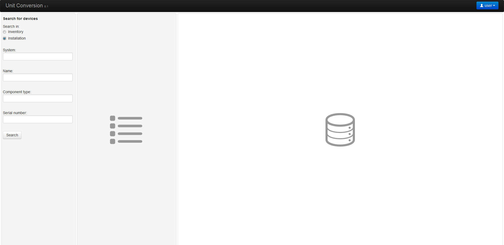
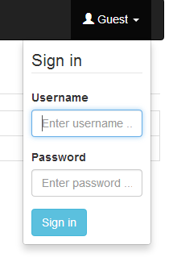
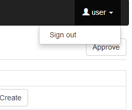
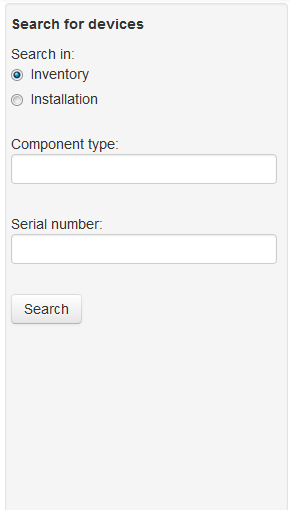
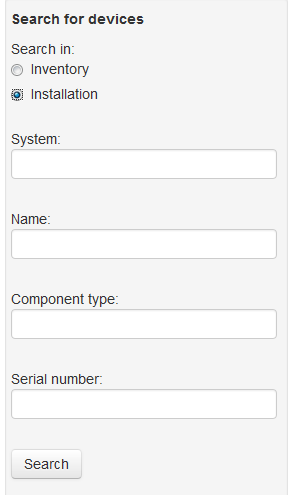
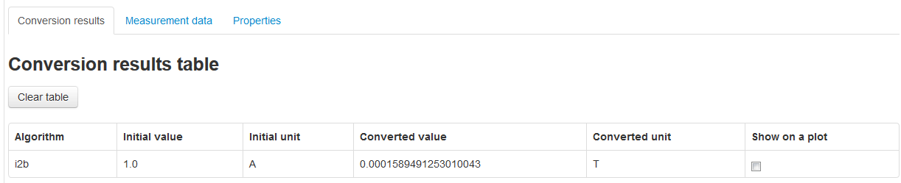

MUNICONV Web Client Interface
=============================

The MUNICONV web client is implemented using *Angular.js* and *jquery*. It connects to the server through a RESTful Interface and is served by the Django server.

Description of the Layout
--------------------------------------------

The web client user interface comprises of 4 main areas:
	* a navigation bar on the top, and
	* the body below which is made up of (from the left):
		- Search pane 
		- Search results/Summary pane
		- Details pane

The top navigation bar contains a dropdown element (at the right) for signing into and out of the system. 

In the body of the user interface, search parameters are entered into the Search pane on the left, results are displayed in a summary format in the middle pane and details of a lattice or model are displayed on the Details pane on the right. 

   
   MUNICONV Home screen.

Sign in / Sign out
--------------------------------------------

By default, installation and inventory information in the database can only be browsed. Adding new installation and inventory data and modifying existing data requires a user account with special permission. Sign in by clicking on the **Guest** button at the top right corner which brings up the Sign In dialog. After entering the account credentials, click on the **Sign in** button.

   
   Sign in

Sign out by clicking on your user name on the top right and selecting **Sign out**.

   
   Sign out

Searching for Existing Data
--------------------------------------------

Any user (i.e. guest and signed in) can search for existing inventory or installation data. 

Select to search for either inventory or installation data with the radio buttons at the top of the Search pane.  

When searching for inventory data, wildcards are supported for `component type`.

   
   Search for inventory data.

When searching for installation data, wildcards are supported for `system`, `name` and `component type`.

   
   Search for installation data.

Results of the search are displayed in the middle pane, in a summary format. Clicking on any individual entry, displays the details of that entry in the Details pane. Results can be further filtered by entering characters corresponding to any of the displayed text.

Working with Inventory Data
--------------------------------------------
Browsing Inventory Data 
~~~~~~~~~~~~~~~~~~~~~~~
[More to come...]

Updating Inventory Data
~~~~~~~~~~~~~~~~~~~~~~~
[More to come...]

Working with Installation Data
--------------------------------------------

Converting Installation Data 
~~~~~~~~~~~~~~~~~~~~~~~~~~~
Simply clicking on an entry in the Results pane opens the details of the selected installation. At the top, enter details of the units to convert. Results of the conversion are displayed in 3 tabs:
* Conversion results
* Measurement data
* Properties

The **Conversion results** tab contains a table displaying the converted value and unit.

   
   Converted Installation units

The **Measurement data** tab allows to display Rotating Coil data or Hall Probe data for the individual device or a component type.

The **Properties** tab displays property information.