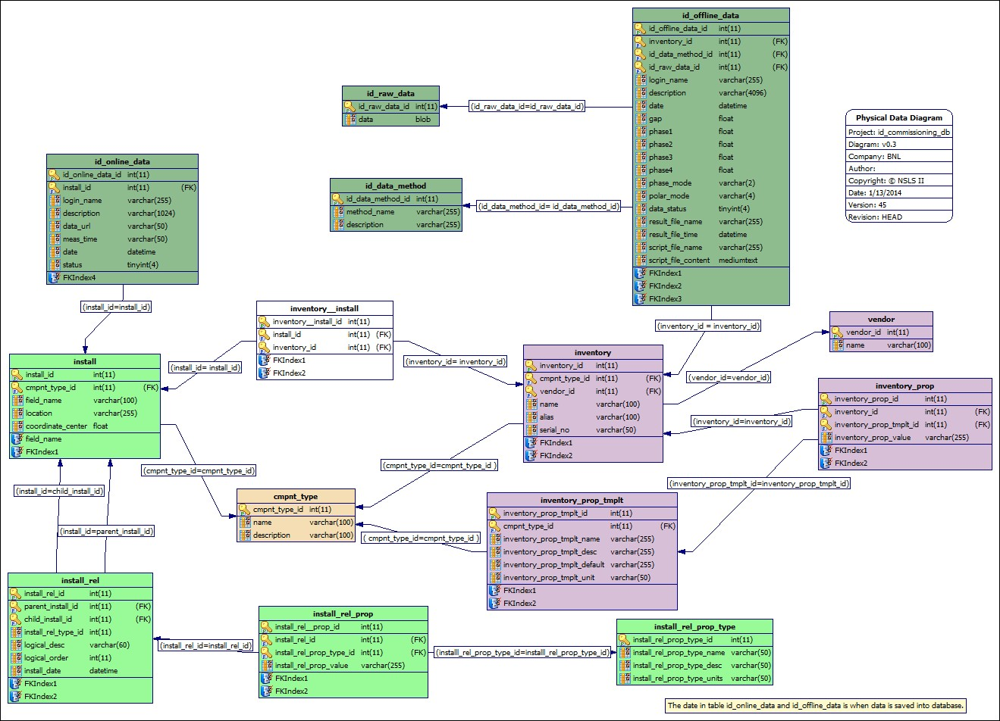

Introduction
==============================================

General
--------------
This Insertion Device Data Storage (IDODS) service is dedicated for the NSLS II (National Synchrotron Light Source II) project, being constructed
at Brookhaven National Laboratory (BNL). All requirements are driven by the NSLS II project, especially its storage ring.

IDODS is a data service for insertion devices, to help store the data for insertion device commissioning and operation. 

The IDODS service aims to capture all static data needed by insertion devices, to save the data in a relational database (RDB) server, 
and to keep all history data. Once data is saved into an RDB, changes to the data are not allowed to prevent any undesired behavior. 
Currently, MySQL is adopted as the back-end RDBMS.

The IDODS service is based on a client/server architecture, and the service is implemented as a RESTful web service using the Django framework.
Two (2) different clients should be provided, which are a web user interface (UI) and an API library in Python.

The source code is managed using Git, and hosted on GitHub:: 

  https://github.com/UnitConversion/unitConversion

The code can be checked out from github with:: 

  git clone http://github.com/UnitConversion/unitConversion.git

Architecture
------------------------
The IDODS data service is based on 3-tiers, which are: ::

    - RDB layer for data storage
    - RESTful web service layer for data handling
    - user client

Its architecture is as illustrated in Figure 1.

.. figure:: _static/idods_arch.png
    :width: 472px 
    :height: 407px
    :align: center
    :alt: alternate text
    :figclass: align-center

    Architecture of IDODS service

Currently, it adopts MySQL as its RDBMS, and all schema are designed against MySQL. Access to the RDB is via a data API layer, 
which isolates the underlying RDB details from the upper layers, and makes schema changes transparent, and the RDBMS pluggable.

The RESTful web service layer is implemented under the Django framework, and is responsible for saving data into and retrieving data from the RDB.

Two (2) different clients, for this service, are being considered at this stage (Phase I): a web UI and a Python library. For the Python library, it is necessary that this API t is kept as similar to the data API as possible.
  

Project Structure
------------------------

The project directory structure is: ::

    dataapi.pyidods            - Data API library in Python to access relational database
    database                   - MySQL database 
    physics_dev/physics_django - REST web service implemented under Django framework
    documents.idods            - Documentation written with sphinx
    utest                      - unit test
    demo                       - an example how to launch server from command line
    example                    - some use cases showing how to use service from client side
    library                    - collection of 3rd party libraries which might be needed

Data Sources 
--------------
An insertion device has 2 different data sources which are measured with and without a beam, called online and offline data, respectively. 

Offline Data
~~~~~~~~~~~~~~~

Offline data is by its nature a specific property of an insertion device. It is always attached into a device in the inventory.
When an insertion device is saved, it goes into inventory with physical properties as below: ::
    
     - device name
     - device/component type
     - device/component description 
     - alias name, could be empty
     - serial number
     - vendor name
     - length
     - up corrector position if it has
     - middle corrector position if it has
     - down corrector position if it has
     - minimum gap
     - maximum gap
     - gap tolerance
     - phase 1 minimum
     - phase 1 maximum
     - phase 2 minimum
     - phase 2 maximum
     - phase 3 minimum
     - phase 3 maximum
     - phase 4 minimum
     - phase 4 maximum
     - phase tolerance
     - linear k value maximum 
     - circular k value maximum
     - polar phase mode name
     - a1 phase mode
     - a2 phase mode 

When generating the offline data, it captures the measurement/calculation method as: ::
    
    - method name
    - description

The data itself consists of some constrains as: ::

    - who saved this data
    - brief description for this data set
    - when this data is loaded
    - gap
    - phase 1
    - phase 2
    - phase 3
    - phase 4
    - phase mode
    - polar mode
    - data status
    - result file name if data is provided through a file
    - result file time stamp if data is provided through a file
    - script file name to generate the data if available
    - script file content to generate the data if available
    - data

Online Data
~~~~~~~~~~~~~~~
A device is only available online after it has been installed. 
An installation can be linked to the inventory through an underlying index table.
An installed device has the following properties: ::

    - name
    - coordinate center information if available
    - parents information through install relationship 
      (which beam line it belongs to, and which project does this beam line belongs to)
    - map device in the inventory into installed device

Once the device is installed and set up properly, the client can give that device online measurement data.

Online data is always attached into an installation, and has the following properties: ::

    - who saved this data
    - brief description for this data set
    - data url since the data size can be quite large, a few hundreds MB
    - measurement time
    - date when this data was saved
    - status

For client convenience, an installation can have component type information.

:NOTE:
    - the client has the flexibility to relink an installation to a different inventory device
    - when that happens, all online data should be invalid for that installation
    - when relinking an installation, update its component type simultaneously  

Data Access API 
-----------------

All information is saved into the underlying RDB. Currently, its schema is as shown in Figure 2.

    RDB schema for idods service

It is suggested to access the RDB via a data API library to avoid unexpected behavior and isolate the applications/services from schema changes.
A detailed API specification can be found in the :ref:`data_api` section.

Requirements
--------------

Version Requirements
~~~~~~~~~~~~~~~~~~~~~

    - Python: 2.7.x 
    - Django: >= 1.4.x
    - python-requests for client: 1.1.x =< version < 2.x
    - MySQL: 5.1.x, 5.5.x

Requirements to Save Data into Data Service
~~~~~~~~~~~~~~~~~~~~~~~~~~~~~~~~~~~~~~~~~~~

    - Only authorized users can save/update some changeable properties.
    - Any user can browse data.
    - Data is accessible through a web UI and a Python library.
    - Data integrity must be maintained when saving and/or updating.
        - All data in or no data in!
    - Wildcards should be supported for string searches.
     
         - "*" for multiple character matching
         - "?" for single character matching

    - A device has to be in the inventory.
    - A device in the inventory has to have a name.
    - A device in the inventory has to belong to a device/component type.
    - Device/component types can be shared, and it is suggested to reuse device/component types.
    - A device in the inventory can have physical properties as described above like minimum gap, maximum gap, length, and so on.
    - A device in the inventory can have vendor information.
    
    - A device in the inventory can have multiple offline data sets.
    - Offline data can be binary, or ASCII.
    - Once offline data is saved, it is suggested that it not be updated, except for its description & status.
    - Only authorized users can update the offline data properties like description and data status. 
    - Offline data has the properties as described above.
    - Offline data can have an associated measurement/calculation method.
    - The measurement/calculation method can be shared, and it is suggested to reuse it.
    - The measurement/calculation method can be saved separately.
    - A device is saved to an installation after it is installed into the field.
    - A name is needed to reflect the installed device, and it is usually different from its inventory name.
    - An installed device has its hierarchy, which is reflected in (install_rel, install_rel_prop, install_rel_prop_type) tables.

        - An installed device can belong to a beam-line.
        - A beam-line can belong to a project.
    - An installed device has some properties like section description, and beam optics description.

    - An installed device can have multiple online data sets.
    - Online data can be binary (HDF5 for example), or ASCII.
    - An installed device can be linked to a device in the inventory.
    - A device in the inventory can be linked **only once**; this needs to be checked when linking and/or relinking.
    
        - If the device in the inventory has already been linked, then the user must be asked how to re-link it and raise an exception.
    
    - An installed device can have device/component type information.
    - Install-inventory mapping can be updated according requirements to reflect physical relocation of the device. 
    - When successfully relinking an installation to another device in the inventory, all previous online data sets are immediately invalid.
    - The online data size can be up to a few hundred MB.
    - The online data url is saved in the RDB instead of the data itself.
    - An efficient and direct way is needed to upload the online data file for both the Python library and the web UI.
    - Once online data is saved, it is suggested that it not be changed, except for its description & status.
    - Only authorized users can update online data properties like description and status.
    
    - A client can browse devices in the inventory and its all properties.
    - From the inventory, a client can only browse offline data.
    - A client can browse offline data in the inventory.
    - A client can retrieve offline data by its inventory name, and other constraints from when the data is generated, for example:
        
        - by gap range, phase1~4 range, time, method, status, etc.
    
    - A client can browse installed devices and their hierarchy (beam line info, and project info).
    - A client can retrieve an online data:
    
        - by its name, and status, measurement time range, description, etc.

    - A client can retrieve an offline data.
    
        - by its installation name,  gap range, phase1~4 range, time, method, status, etc.
    
    - Searching offline data has to go through the ``inventory__install`` index table. It is not allowed to use the ``cmpnt_type`` table to retrieve the inventory information of an installed device.
    
A full unit test is needed as follows:

    - All data API
    - All RESTful interface
    - WEB UI
    - Python client library

Documentation

    - all functions should be properly documented
    - documents should be updated and synchronized with any change   