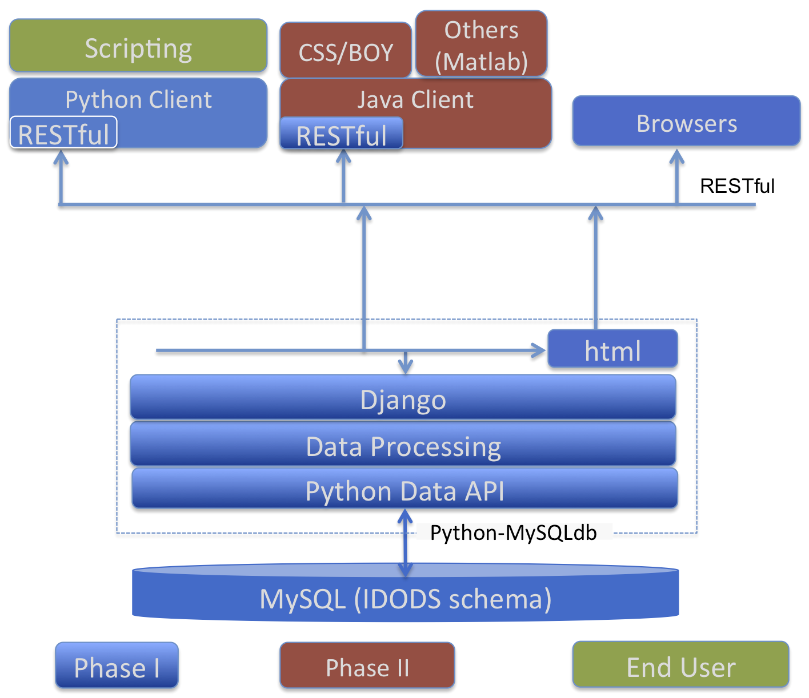
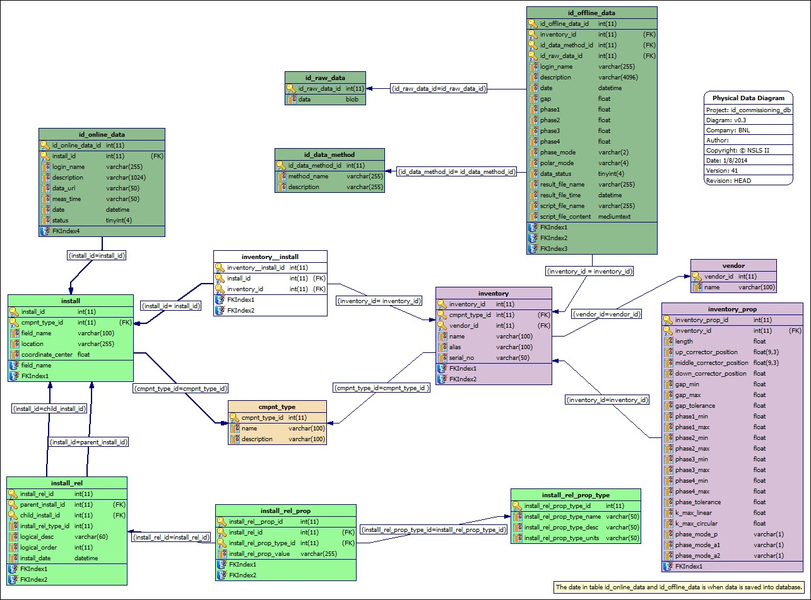

Introduction
==============================================

General
--------------
This system is dedicated for NSLS II (National Synchrotron Light Source II) project, which is constructed
at BNL (Brookhaven National Laboratory). All requirements are driven by NSLS II project at BNL, especially its storage ring.

This system is a data service for insertion device, and to help to store the data for insertion commissioning and operation.

It is to capture all static data which are needed by insertion devices, saves data in RDB (relational database) server, 
and keep all data history data. Once data is saved into RDB database, it is not allowed to change the data content anymore to prevent any undesired behavior. 
Currently, MySQL is adopted as back-end RDBMS.

This data service is a client/server based architecture, and service is implemented as a RESTful web service using Django framework.
Two (2) different client should be provided, which are web UI and an API library in Python.

The source code is managed using Git, and hosted on GitHub as below :: 

  https://github.com/UnitConversion/unitConversion

The code could be check out from github as below :: 

  git clone http://github.com/UnitConversion/unitConversion.git

Architecture
------------------------
The data service for insertion device is 3-tier based, which are: ::

    - RDB layer for data storage
    - RESTful web service layer for data handling
    - user client

Its architecture is as illustrated in Figure 1.1.

    Architecture of idods service

Currently, it adopts MySQL as RDBMS, and all schema are designed against MySQL. The accessing to RDB is via a data API layer, 
which isolates the underneath RDB detail from its upper layer, and make schema changes transparent, and RDBMS pluggable.

The RESTful web service layer is implemented under Django framework, and responsible to save data into and retrieve data from RDB.

Two (2) different clients are considering at phase I stage for this service, which are web UI, and Python library. For the Python library,
it is needed to keep the API same with data API as much as possible.
  

Project structure
------------------------

Project directory structure is as below: ::

    dataapi.pyidods            - Data API library in Python to access relational database
    database                   - MySQL database 
    physics_dev/physics_django - REST web service implemented under Django framework
    documents.idods            - Documentation written with sphinx
    utest                      - unit test
    demo                       - an example how to launch server from command line
    example                    - some use cases showing how to use service from client side
    library                    - collection of 3rd party libraries which might be needed

Data Sources 
--------------
An insertion device has 2 different data sources which are measured with and without beam. The data measured without beam is usually called offline data,
and online data for that with beam.

Offline data
~~~~~~~~~~~~~~~

An offline data is its nature property of an insertion device. It is always attached into a device in inventory.
When an insertion device is saved, it goes into inventory with physical properties as below: ::
    
     - device name
     - device/component type
     - device/component description 
     - alias name, could be empty
     - serial number
     - vendor name
     - length
     - up corrector position if it has
     - middle corrector position if it has
     - down corrector position if it has
     - minimum gap
     - maximum gap
     - gap tolerance
     - phase 1 minimum
     - phase 1 maximum
     - phase 2 minimum
     - phase 2 maximum
     - phase 3 minimum
     - phase 3 maximum
     - phase 4 minimum
     - phase 4 maximum
     - phase tolerance
     - linear k value maximum 
     - circular k value maximum
     - polar phase mode name
     - a1 phase mode
     - a2 phase mode 

When generating an offline data, it captures the measurement/calculation method as below: ::
    
    - method name
    - description

The data itself consists of some constrains as below: ::

    - who saved this data
    - brief description for this data set
    - when this data is loaded
    - gap
    - phase 1
    - phase 2
    - phase 3
    - phase 4
    - phase mode
    - polar mode
    - data status
    - result file name if data is provided thru a file
    - result file time stamp if data is provided thru a file
    - script file name to generate the data if available
    - script file content to generate the data if available
    - data

Online data
~~~~~~~~~~~~~~~
A device is only available online after it is installed. 
An installation could be linked into inventory thru underneath index table.
An installed device has properties as below: ::

    - name
    - coordinate center info if available
    - parents information thru install relationship 
      (which beam line it belongs to, and which project does this beam line belongs to)
    - map device in inventory into installed device

Once the device is installed and set up properly, client can give that device an online measurement data.

An online data is always attached into an installation, and has properties as below: ::

    - who saved this data
    - brief description for this data set
    - data url since the data size could be quit large a few hundreds MB
    - measurement time
    - date when this data is saved
    - status

For client convenience, an installation could have component type information.

**NOTE** ::

    - client has flexibility to relink installation into different inventory device
    - when that happens, all online data should be invalid for that installation
    - when relinking an installation, update its component type simultaneously  

Data Access API 
-----------------

All the information are saved into underneath RDB. Currently, its schema is as Fig. 1.2.

    RDB schema for idods service

It is suggested to access to the RDB via a data API library to avoid unexpected behavior and isolate the applications/services from schema changes.
Detailed API specification can be found in "Data API" section.

Requirements
--------------

Version requirements.

    - Python: 2.7.x 
    - Django: >= 1.4.x
    - python-requests for client: 1.1.x =< version < 2.x
    - MySQL: 5.1.x, 5.5.x

Here is description for the requirements to save data into data service.

    - Only authorized user can save/update some changeable properties
    - Any user can browse data
    - Data is accessible thru web UI and Python library
    - Have to keep data integrity when saving and/or updating
    
        - All data in or none data in
    
    - wildcard should be supported for the string search
     
         - "*" for multiple characters matching
         - "?" for single character matching

    - A device has to be in inventory 
    - A device in inventory has to have a name
    - A device in inventory has to belong to a device/component type
    - Device/component type can be shared, and it is suggested to reuse device/component type
    - A device in inventory could have physical properties as described above like minimum gap, maximum gap, length, and so on
    - A device in inventory could have a vendor information
    
    - A device in inventory could have multiple offline data sets
    - Offline data could be a binary, or ASCII.
    - Once offline data is saved, it is not suggested to update it except its description & status
    - Only authorized user can update the offline data properties like description and data status 
    - Offline data has properties as described above
    - Offline data could have a measurement/calculation method associated
    - measurement/calculation method can be shared, and it is suggested to reuse it
    - measurement/calculation method can be saved separately
    - A device is saved to installation after it is installed into field
    - A name is needed to reflect the installed device, and it is usually different from its inventory name
    - An installed device has its hierarchy, which is reflected in (install_rel, install_rel_prop, install_rel_prop_type) tables

        - An installed device could belong to a beam-line
        - A beam-line could belong to a project

    - An installed device can have multiple online data sets
    - Online data could be a binary (HDF5 for example), or ASCII
    - An installed device could be linked to a device in inventory
    - Device in inventory can be linked **only once**, need to check when linking and/or relinking
    
        - If the device in inventory has been linked, need to ask user how to do it and raise an exception
    
    - An installed device could have device/component type information
    - Install-inventory mapping could be updated according requirement to reflect device relocation physically
    - When successfully relinking installation into another device in inventory, all previous online data sets are invalid immediately.
    - Online data size could be up to a few hundreds MB
    - Online data url is saved in RDB instead of data itself
    - An efficient and direct way is needed to upload the online data file for both Python library and web UI
    - Once online data is saved, it is not suggested to change it except its description & status
    - Only authorized user can update online data properties like description and status
    
    - Client could browse devices in inventory and its all properties
    - From inventory, client can only browse offline data 
    - Client could browse offline data in inventory
    - Client could retrieve offline data by its inventory name, and given constrains when the data is generated
        
        - by gap range, phase1~4 range, time, method, status, and so on 
    
    - Client could browse installed devices and its hierarchy (beam line info, and project info)
    - Client could retrieve an online data
    
        - by its name, and status, measurement time range, description, and so on

    - Client could retrieve an offline data
    
        - by its installation name,  gap range, phase1~4 range, time, method, status, and so on
    
    - Searching offline data has to go thru inventory__install index table. It is not allowed to use cmpnt_type table to get inventory information of an installed device
    
A full unit test is needed as described below.

    - All data API
    - All RESTful interface
    - WEB UI
    - Python client library

Documentation

    - all functions should be properly documented
    - documents should be updated and synchronized with any change 
    