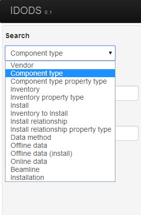
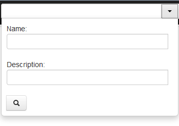
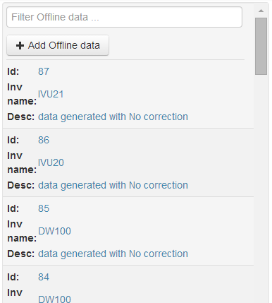
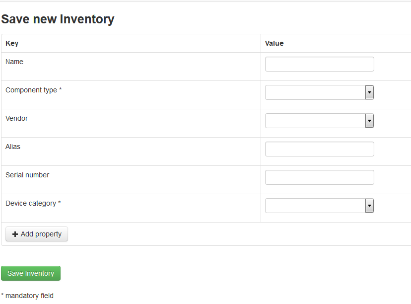
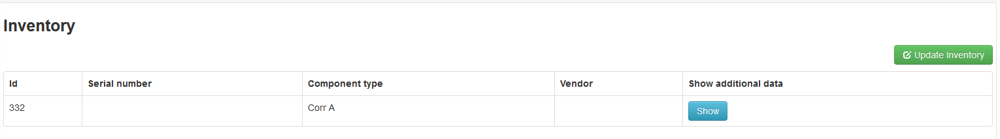
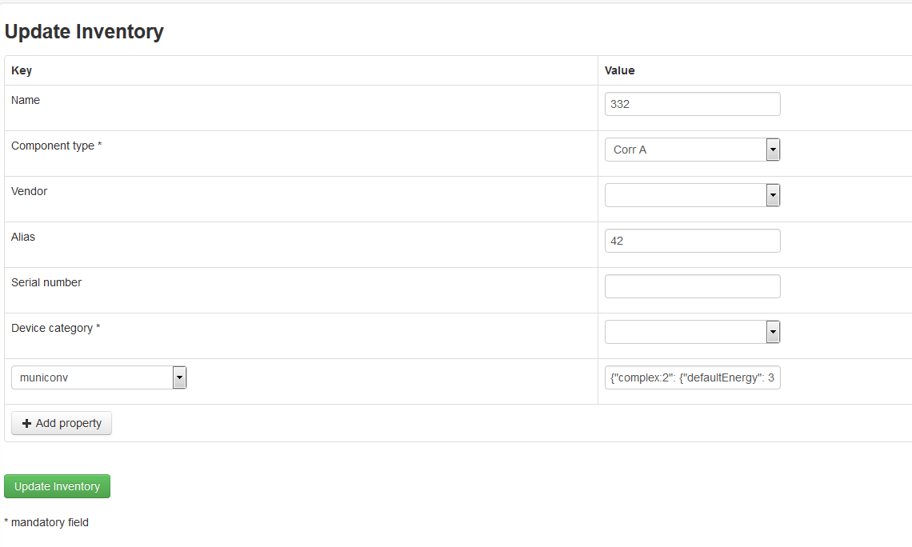
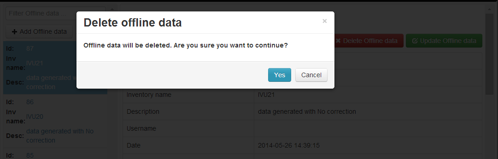
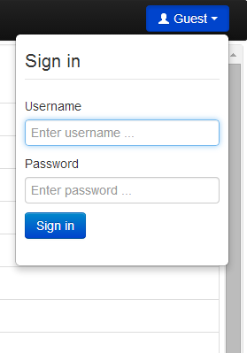

IDODS Web Client
==============================================

The IDODS web client is implemented using *Angular.js* and *jquery*. It connects to the server through a RESTful Interface and is served by the Django server.

The web client is a tool for searching, adding and modifying data and it tries to offer all these actions in a clean, modular way. 

Description of the Interface
-----------------------------

Layout
~~~~~~~~

The web user interface comprises of 3 main regions: a top bar, a result/summary pane, in the body, on the left and a details pane, in the body, on the right. 

.. figure:: _static/ui.png
   :scale: 50%

   Home screen displaying details of a Component type 

The top bar contains 3 dropdowns. From the left, these: 
	* select entities e.g. Offline data, Install, Component type, etc.
	* search/navigate entries,
	* allow users to login and logout of the system.

Usage of the Interface
------------------------

Navigating through Views/Data
~~~~~~~~~~~~~~~~~~~~~~~~~~~~~~

The left-most dropdown on the top bar allows for selection of entities e.g., Offline data, Install, Component type, etc. When an item is selected from the dropdown menu, the page is automatically reloaded with the new data.

   Dropdown menu for selecting a View

Searching
~~~~~~~~~~~

The middle dropdown on the top bar allows a user to search through entries in the database by Name or Description. When a name or description is filled in, click on the magnifier to search. If neither Name nor Description is filled in, when the magnifier is clicked, all the entries of the database are returned. 

   Online data search form

The search fields also allow use of wildcards for more complex searches. The following wildcard characters can be used:

- \* for multiple character matching
- ? for single character matching

Search results appear in the appear in the result/summary pane on the left. Every item in the list has a summary of the complete result e.g. name and description. By clicking on it, complete result will appear in the details pane on the right.

   Example of a wildcard search and offline data results in the left pane

Search results can also be further filtered by entering a filter string in the text field at the top. Results that do not match the filter will not be displayed in the list of results.

Adding Data
~~~~~~~~~~~~

To the right of the Search dropdown, there is a context-sensitive button that allows you to add new data into the database. 

Context-sensitive add button
   
After clicking on the add button, a form appears in the details pane. 

Form to add Inventory

After the form has been filled in, click on the **Save** button to save the data. Mandatory fields are indicated with an \* after the field name.

In some of the views, new properties can be added., by clicking on the **+Add property** button, selecting the key from the dropdown list and inserting a value.

Updating Data
~~~~~~~~~~~~~~

Existing data can be updated by clicking on the **Update** button which is located in the top right corner in the details pane. 

   Button to update Inventory

After clicking on the button, a form is displayed with the exisiting values filled in. After the values have been modified, click on the **Update** button which is placed below the form to save updated data.

   Form for updating Inventory

Deleting Data
~~~~~~~~~~~~~~

Some data can also be deleted. For the cases when the data can be deleted, the **Delete** button will be displayed in the top right corner of the detail pane. After clicking on the Delete button, a confirmation dialog will be displayed. Clicking on **Yes** will delete the data.

   Form for deleting Offline data

Sign In/Sign Out
~~~~~~~~~~~~~~~

All actions that modify the data can only be executed by an authenticated user. To execute those action on a web client, the user must sign in. Sign-in is done by clicking on the button in the top right corner which is called **Guest** when a user is not signed in. After clicking on the button, a dropdown will appear which allows the user to sign in. The user should enter the login credentials and click on the **Sign in** button. If the entered credentials are correct, the page will refresh and user will be signed in.

   Sign in form