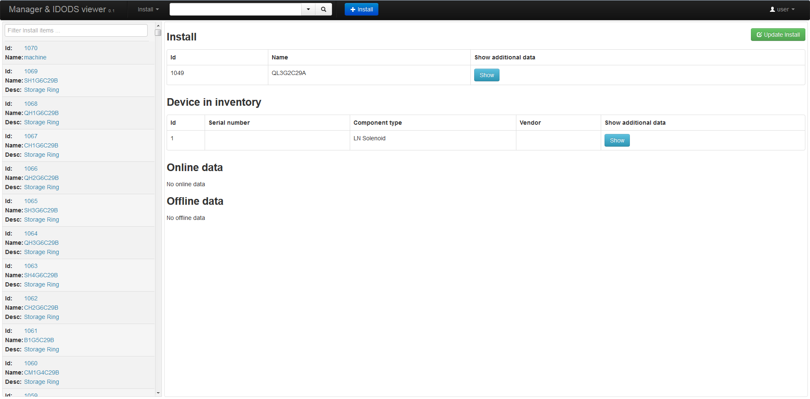

Web client
==============================================

Web client is implemented using *Angular.js* and *jquery*. It connects to the server through RESTful Interface and is served by the Django server.

It is a tool for searching, adding and modifying data and it tries to offer all these actions in a clean, modular way. It separates entities e.g. Offline data, Install, Component type, ... 

Description of the interface
-----------------------------

Layout
~~~~~~~~

Web user interface comprises of search/navigation pane on the left, result/summary pane in the middle and details pane on the right. On the top right there is a dropdown menu that allows user to log in and log out of the system.

   
   Home screen is displaying Component type

Usage of the interface
------------------------

Navigating through views/data
~~~~~~~~~~~~~~~~~~~~~~~~~~~~~~

Every view has a dropdown menu at the top of the left pane. By selecting an item from the dropdown menu, page will automatically reload with the new data.

Searching
~~~~~~~~~~~

You can search through a data by navigating to the right view, filling out the search inputs in the left search pane and clicking **Search** button.

String search fields also allow you to use wildcard characters to make more complex searches. In you search strings, you can use the following wildcard characters:

- \* for multiple characters matching
- ? for single character matching

After clicking on a search button, results will appear in the middle pane. Every item in the list has a summary of the complete result e.g. name and description. By clicking on it, complete result will appear in the right, details pane.

Adding data
~~~~~~~~~~~~

At the top of the middle pane there is an **Add** button that allows you to add a new data into the database. After clicking on it, form will appear in the details pane. After you fill in the form you can click on a **Save** button to save it. Mandatory fields are labeled by a name followed by a \* symbol.

In some of the views you can add new properties. You can add them by clicking on **Add property**, selecting key from the dropdown and inserting a value.

Updating data
~~~~~~~~~~~~~~

You can update existing data by clicking on **Update** button which is located in the top right corner in the details pane. After clicking on in, form is displayed with old values already filled in. After you modify values you can click on **Update** button which is placed below the form to save updated data.

Deleting data
~~~~~~~~~~~~~~

Some of the data can also be deleted. **Delete** button will be displayed in the top right corner of the detail pane. After clicking on it, confirmation pop-up will be displayed. Clicking the **Yes** button will delete the data.