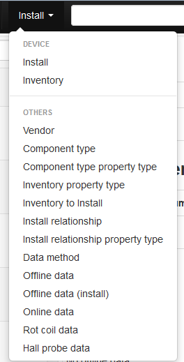
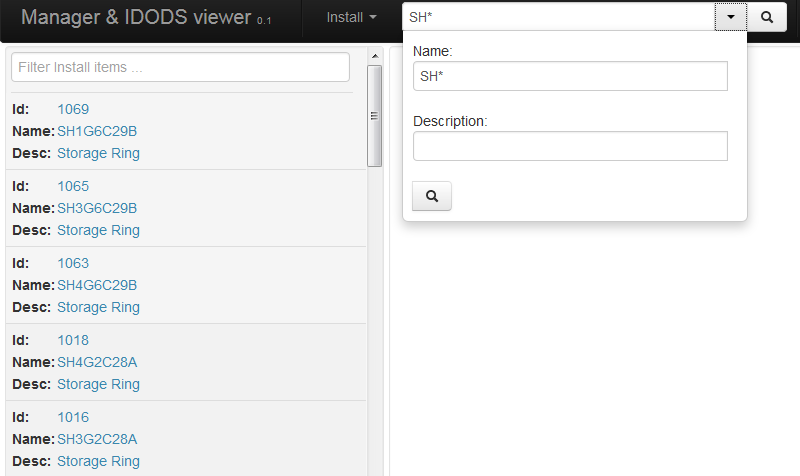

IDODS Web Client
==============================================

The IDODS web client is implemented using *Angular.js* and *jquery*. It connects to the server through a RESTful Interface and is served by the Django server.

The web client is a tool for searching, adding and modifying data and it tries to offer all these actions in a clean, modular way. 

Description of the Interface
-----------------------------

Layout
~~~~~~~~

The web user interface comprises of 3 main regions: a top bar, a result/summary pane, in the body, on the left and a details pane, in the body, on the right. 

.. figure:: _static/ui.png
   :scale: 50%

   Home screen displaying details of a Component type 

The top bar contains 3 dropdowns. From the left, these: 
	* select entities e.g. Offline data, Install, Component type, etc.
	* search/navigate entries,
	* allow users to login and logout of the system.

Usage of the Interface
------------------------

Navigating through Views/Data
~~~~~~~~~~~~~~~~~~~~~~~~~~~~~~

The left-most dropdown on the top bar allows for selection of entities e.g., Offline data, Install, Component type, etc. When an item is selected from the dropdown menu, the page is automatically reloaded with the new data.

   Dropdown menu for selecting a View

Searching
~~~~~~~~~~~

The middle dropdown on the top bar allows a user to search through entries in the database by Name or Description. When a name or description is filled in, click on the magnifier to search. If neither Name nor Description is filled in, when the magnifier is clicked, all the entries of the database are returned. 

.. figure:: _static/search.png
   :scale: 50%

   Online data search form

The search fields also allow use of wildcards for more complex searches. The following wildcard characters can be used:

- \* for multiple character matching
- ? for single character matching

Search results appear in the appear in the result/summary pane on the left. Every item in the list has a summary of the complete result e.g. name and description. By clicking on it, complete result will appear in the details pane on the right.

   Example of a wildcard search and offline data results in the left pane

Search results can also be further filtered by entering a filter string in the text field at the top. Results that do not match the filter will not be displayed in the list of results.

Adding Data
~~~~~~~~~~~~

At the top of the middle pane there is an **Add** button that allows you to add a new data into the database. After clicking on it, form will appear in the details pane. After you fill in the form you can click on a **Save** button to save it. Mandatory fields are labeled by a name followed by a \* symbol.

In some of the views you can add new properties. You can add them by clicking on **Add property**, selecting key from the dropdown and inserting a value.

   Form for saving new Component type

Updating data
~~~~~~~~~~~~~~

You can update existing data by clicking on **Update** button which is located in the top right corner in the details pane. After clicking on in, form is displayed with old values already filled in. After you modify values you can click on **Update** button which is placed below the form to save updated data.

   Form for updating Component type

Deleting data
~~~~~~~~~~~~~~

Some of the data can also be deleted. **Delete** button will be displayed in the top right corner of the detail pane. After clicking on it, confirmation pop-up will be displayed. Clicking the **Yes** button will delete the data.

.. figure:: _static/delete_component_type.png
   :scale: 50%

   Form for deleting Offline data

Sign in/Sign out
~~~~~~~~~~~~~~~

All actions that modify the data can only be executed by an authenticated user. To execute those action on a web client, user has to sign in. He can do that by clicking on the button in the top right corner which has a **Guest** label when user is not signed in. After clicking on a button dropdown will show up with sign in form. User should enter his credentials and click on the **Sign in** button. If entered credentials are correct, page will refresh and user will be signed in.

.. figure:: _static/sign_in.png
   :scale: 50%

   Sign in form