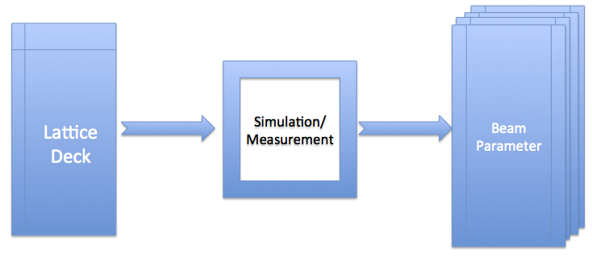
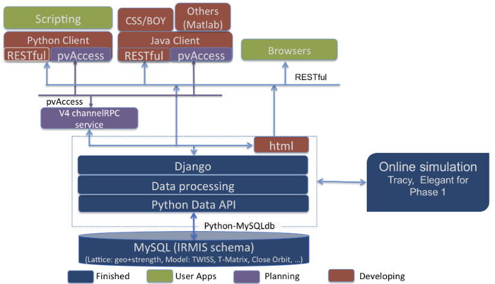

Lattice/Model service
=====================

Introduction
------------
The lattice/model service consists of 2 parts, which are lattice part and model part respectively as its name indicated.

The lattice part stores all information related to element geometric layout, and its magnetic strength. 

The model part captures beam parameters such as beam TWISS parameters, and closed orbit, which could be from either simulation or measurement.

The relation between a lattice and a model is as shown as Fig. 1.

    Fig. 1: Generate model results from a lattice deck

The current release is implemented using Django framework, and serves data through REST web service. Integrating this service into EPICS V4 framework
has been planned, and will be implemented in its next major release.

Terminology
-----------
The terminologies used in this service are defined as below:

*Element*:
    One individual component of a lattice.

*lattice*:
    an accelerator geometric layout with magnetic strength setting for each element.

*Lattice Deck*:
    an input container for a particular simulation code. For example .lat file for Tracy, or .lte file for enegant

*Model*:
    a result from either simulation or measurement for a lattice.

*Tracy*:
    a particle accelerator simulation code [1]_

*elegant*:
    a particle accelerator simulation code [2]_

**Note**: 

- One lattice could consist of one or more elements. One element could be a real device physically installed somewhere, a quadrupole magnet for example,
  or a virtual device, a marker for example.
- One Lattice deck may contain many of lattices. Typically, a lattice deck is an input file for one particular simulation code, which has some LINE definition.
  The lattice is one of those pre-defined lines, which is going to load into simulation code. 
- One lattice may have many of models. One lattice with different simulation code, and/or different simulation algorithm is a different model 
  since it produces different results.

Architecture
-------------
The system architecture is shown in Fig. 2 as below:

    Fig. 2: Service Architecture

The service consists of 3 layers, which are RDB layer, service layer, and client layer respectively.

- *RDB layer*. All data are stored inside this layer. The data could be a real data, element name, magnetic strength for example, or a link to point to an external file on file system. The RDB schema is derived from IRMIS schema, which was originally developed by Don Dohan at Brookhaven National Laboratory. It uses MySQL RDBMS (relational database management system) as backend data storage engine. 
- *Service layer*. The service layer responses to answer the request from client, and server data back from or save data into database. The database access is thru a data API (application programming interface), which isolates the RDB access details and business logic from RDB client. Advantage with the data API is that is makes inner schema changes transparent to RDB client, which give both the RDB schema expert and service developer more flexibility. Two major functions are provided in this layer. (1) As a data storage center, receiving all data from client, and storing into the RDB, and serving data back. (2) Providing a quick online simulation when a proper lattice deck with required model control information is provided.
- *Client layer*. The client layer provides an interface to end user in 2 kinds of format: (1) API library, which can be used by a client application, for example Python scripting or Matlab application; (2) user interface, a graphic interface from browser, or CSS (Control System Studio) application.

The service is implemented using Django framework, and at phase I, serves data thru REST web-service. An extension to EPICS V4 and serving data thru pvAccess (EPICS V4 communication protocol) will be implemented in its next major release.

Lattice
-------
As described above, the lattice captures element geometric layout with one particular magnetic strength. The information includes lattice description and lattice data.

A lattice description information could be as below:

- lattice name, could be up to 255 characters
- lattice version, which is a numeric number
- lattice branch name, could be up to 50 characters
- brief description, could be up to 255 characters
- who created this lattice first time
- when this lattice was created first time
- who updated/modified this lattice last time
- when this lattice was updated/modified last time
- raw lattice data file

A particular lattice could be identified by its name, version and branch, which means a given lattice for one branch at given version is unique.
For a particular lattice, it saves the following information:

- element name: name of each element in the lattice;
- element position: which is also so-called "s" location;
- element sequence index: be aware that since lots of simulation code has an internal element at its start point, "BEGIN" in tracy and "_BEG_" in elegant for example. Since such kind of element is not included in lattice deck, the first index should be one(1) for those codes, otherwise, should be zero (0).
- element length;
- mis-alignment information, displacement (dX, dY, dZ), and rotation (pitch, yaw, and row);
- element type: the type defined in a lattice. The lattice service does not force any element type, and does not use internal type. Therefore, it saves whatever the type from client, a lattice file for example. An element type could be for example "Quadrupole" (Tracy example), or "KQUAD" (elegant example).
- element type property: attribute names of an element type, for example for CSBEND (One element type defined in elegant), it could have property like ANGLE for bend angle, E1 for entrance edge angle, E1 for exit edge angle and so on.
- element type property value: value for each type property, for example 0.10472 rad for ANGLE, 0.05236 rad for E1, 0.05236 rad for E2, and so on.

A lattice is also associated with a status, which is an integer number. Users can use this as their own way, and a typical use case is to identify whether a lattice is a golden lattice by applying their own convention. The lattice status could have information as below:

- lattice id to identity which lattice the status is for
- who created this lattice first time
- when this lattice was created first time
- who updated/modified this lattice last time
- when this lattice was updated/modified last time
- latest status id, which is an integer number

If the lattice is carried with type of format, an lattice deck or a flat text file for example, the type information with its format is also captured. For example, an elegant lattice could be captured with its type as "elegant", and its format as "lte".

Model
-------
A model is defined as one result generated by either a simulation code with a given lattice, or a measurement. It creates a new model when simulation code change, or algorithm used by a simulation change, or a new measurement was conducted.

The data consists of 2 types, which are global beam parameters like tune values, chromaticities, and some description information, and beam parameters for each element like twiss parameters, closed orbit, and so on.

Global model information could be as below:

- model name, could be up to 255 characters, and is unique
- lattice id, to identify which lattice this model belongs to
- brief description, could be up to 255 characters
- who created this lattice first time
- when this lattice was created first time
- who updated/modified this lattice last time
- when this lattice was updated/modified last time
- horizontal and vertical tunes
- horizontal and vertical chromaticities, up to 3rd order
- final beam energy
- momentum compaction factor, :math:`\alpha_c`
- model control information, the control information if it applies, the ele file content of elegant for example
- model control name, the name of the control if it applies, the ele file name of elegant for example

Beam parameter for each element could be as below:

- model id, to identify which model this beam parameter belongs to
- element name, to identify which element this beam parameter is for
- position generated by for example a simulation
- twiss parameters, :math:`(\alpha_x, \alpha_y, \beta_x, \beta_y, \gamma_x, \gamma_y, \eta_x, \eta_y, \\eta'_x, \\eta'_y, \nu_x, \nu_y)`
- closed orbit, :math:`(cod_x, cod_y)`
- transfer matrix, normally it is a :math:`6\times6` linear matrix
- bean energy at each element
- particle properties (particle mass, charge, density)
- beam current
- coordinates, :math:`(x, x', y, y', z, z')`
- emittance :math:`(\epsilon_x, \epsilon_y, \epsilon_z)`

A model is also associated with a status, which is an integer number. Users can use this as their own way, and a typical use case is to identify whether a model is a golden model by applying their own convention. The model status could have information as below:

- model id to identity which model the status is for
- who created this lattice first time
- when this lattice was created first time
- who updated/modified this lattice last time
- when this lattice was updated/modified last time
- latest status id, which is an integer number

The model simulation code information could be captured also if it applies with the algorithm used during performing simulation.

-------

.. [1] M. Boge, "Update on TRACY-2 Documentation", SLS Internal Note, SLS-TME-TA-1999-0002 (1999)
.. [2] M. Borland, "ELEGANT: A Flexible SDDS-Compliant Code for Accelerator Simulation", Advanced Photon Source LS-287, September 2000.

